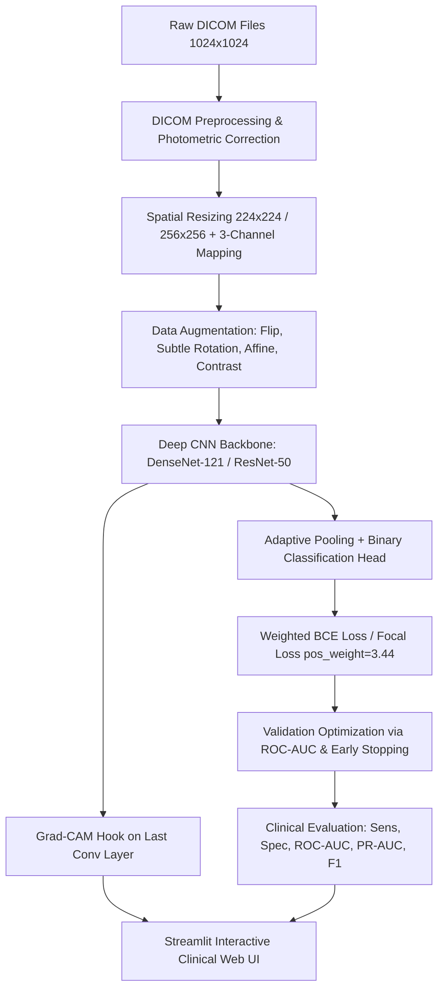

# RSNA Chest X-Ray Pneumonia Detection System (CV OEP)
## Comprehensive Technical Exploration, Status Audit & Roadmap Report

---

### Executive Summary

| Attribute | Details |
| :--- | :--- |
| **Project Title** | Chest X-Ray Pneumonia Detection & Localization System |
| **Context / Course** | Computer Vision Open-Ended Project (CV OEP) |
| **Dataset Benchmark** | RSNA Pneumonia Detection Challenge (NIH ChestX-ray14 subset) |
| **Primary Task** | Image-level binary classification (`0 = No Pneumonia`, `1 = Pneumonia`) + Explainability (Grad-CAM opacity localization) |
| **Execution Environment** | Python 3.13.5 with PyTorch 2.13.0+cpu, Torchvision, PyDICOM, OpenCV, Scikit-learn, Streamlit |
| **Storage Location** | `E:\CV_OEP` |
| **Current Project Stage** | **Data Phase Complete (Phases 1 & 2 done)**; Ready for **Model Architecture & Training (Phases 3–6)** |

---

## 1. Directory Structure Exploration & Inventory

An exhaustive traversal of `E:\CV_OEP` reveals the following structure:

```
E:\CV_OEP
│
├── .venv/                              # Python 3.13 virtual environment with all core dependencies installed
├── dataset/                            # Dataset repository & split metadata
│   ├── stage_2_train_labels.csv        # Raw RSNA annotations (30,227 rows, 26,684 unique patients)
│   ├── stage_2_train_labels.csv.zip    # Compressed backup of annotations
│   ├── stage_2_train_images/           # 26,684 DICOM (.dcm) files (100% verified, ~3.82 GB)
│   └── splits/                         # Patient-level stratified split partitions (No data leakage)
│       ├── split_metadata.json         # Distribution audit, seed=42, exact patient counts
│       ├── train.csv                   # 18,678 patients (4,208 positive / 14,470 negative)
│       ├── val.csv                     # 4,003 patients (902 positive / 3,101 negative)
│       └── test.csv                    # 4,003 patients (902 positive / 3,101 negative) [LOCKED]
│
├── src/                                # Modular production-grade source packages
│   ├── __init__.py                     # Package root
│   ├── data/                           # DICOM loaders, normalization, splitting & analytics
│   │   ├── analyze_dataset.py          # Phase 1 exploratory data analysis script
│   │   ├── split_data.py               # Patient-stratified split generator (70/15/15)
│   │   └── __init__.py
│   ├── models/                         # Deep neural network architectures (To be implemented)
│   │   └── __init__.py
│   ├── training/                       # Loss functions, optimizers, trainer loop (To be implemented)
│   │   └── __init__.py
│   ├── evaluation/                     # Clinical metrics: ROC-AUC, PR-AUC, Sens/Spec (To be implemented)
│   │   └── __init__.py
│   ├── explainability/                 # Grad-CAM heatmap visualization (To be implemented)
│   │   └── __init__.py
│   └── inference/                      # Standalone prediction engine (To be implemented)
│       └── __init__.py
│
├── app/                                # Streamlit web application frontend (UI to be built)
│   └── .gitkeep
├── checkpoints/                        # Model weights directory (best_model.pth, etc.)
│   └── .gitkeep
├── kaggle_cache/                       # Cache artifacts from Kaggle CLI downloads
├── results/                            # Generated visual plots, metrics logs, and audit reports
│   ├── dataset_analysis.json           # Machine-readable Phase 1 EDA report
│   ├── dataset_analysis_report.txt     # Human-readable Phase 1 EDA summary
│   ├── class_distribution.png          # Visual class balance chart (22.53% vs 77.47%)
│   ├── bounding_box_analysis.png       # Bounding box geometry & multiplicity analysis
│   └── failed_downloads.json           # Log of download errors (0 failed, completely clean)
│
├── scripts/                            # Operational automation scripts
│   ├── download_dataset.py             # Kaggle CLI multi-threaded downloader with backoff
│   └── extract_and_validate.py         # Archive decompression & 100% PyDICOM validation engine
│
├── requirements.txt                    # Project dependency specification
└── README.md                           # Master technical project README
```

---

## 2. What Are We Trying to Do? (Problem Definition & Objectives)

### 2.1 Clinical Problem
Pneumonia is an acute respiratory infection affecting the alveoli within one or both lungs, leading to consolidation and fluid accumulation that manifests radiologically as **lung opacities**. In clinical workflows:
- Chest Radiography (CXR) is the frontline diagnostic imaging modality worldwide.
- Radiologist scarcity, high clinical caseloads, and subtle opacity presentations lead to diagnostic delay and diagnostic fatigue.
- Rapid automated triage can prioritize urgent positive scans in emergency and outpatient queues.

### 2.2 Computer Vision Problem Formulation
We are formulating this project as a **Supervised Binary Medical Image Classification with Visual Explainability**:
1. **Input**: A raw single-frame 16-bit or 12-bit grayscale DICOM image $\mathbf{X} \in \mathbb{R}^{H \times W}$ (where $H=W=1024$).
2. **Output**: A calibrated posterior probability $\hat{y} \in [0, 1]$ representing the likelihood that the patient radiograph exhibits pneumonia.
3. **Class Definition**:
   - $y = 1$ (**Pneumonia**): Radiograph exhibits confirmed visual lung opacities characteristic of pneumonia (22.53% prevalence).
   - $y = 0$ (**No Pneumonia**): Radiograph exhibits either normal lung fields or non-pneumonia radiological findings (77.47% prevalence).
4. **Visual Interpretability**:
   - Production of Grad-CAM (Gradient-weighted Class Activation Maps) $\mathbf{M} \in \mathbb{R}^{H \times W}$ highlighting the precise spatial regions in the lungs that activated the deep convolutional feature maps, allowing validation against the expert radiologist bounding boxes provided by RSNA.

---

## 3. How Are We Going to Solve It? (Methodology & Architecture)

Our systematic, multi-stage engineering plan comprises 6 technical pillars:



### Pillar 1: Medical Image Preprocessing Pipeline (`src/data/dicom_utils.py` & `dataset.py`)
- **Photometric Interpretation Handling**: Radiographs tagged as `MONOCHROME1` (where 0 is white and max value is black) must be inverted so bone/air density matches `MONOCHROME2` (where 0 is black and max value is white).
- **Dynamic Range Windowing**: Rescale 12/16-bit raw pixel values using Rescale Slope & Intercept metadata, followed by min-max normalization to $[0.0, 1.0]$.
- **Dimension Standardization**: Resize from $1024 \times 1024$ to $224 \times 224$ (or $256 \times 256$) for computational efficiency on CPU/GPU.
- **Channel Adaptation**: Replicate grayscale to 3 channels $(C=3)$ to leverage ImageNet pre-trained feature extractors.
- **Data Augmentations**: Horizontal flipping, small rotations ($\pm 7^\circ$), affine scaling, and subtle brightness jittering. Crucially, avoid vertical flipping (anatomically impossible) and excessive shearing.

### Pillar 2: Addressing Class Imbalance (3.44 : 1 Ratio)
With 20,672 negative vs. 6,012 positive images, naive cross-entropy leads models to predict the majority negative class. We mitigate this using:
- **Weighted Binary Cross Entropy with Logits**:
  $$\mathcal{L}(y, \hat{y}) = - \left[ w_{\text{pos}} \cdot y \log(\sigma(\hat{y})) + (1 - y) \log(1 - \sigma(\hat{y})) \right]$$
  where $w_{\text{pos}} = \frac{N_{\text{neg}}}{N_{\text{pos}}} = \frac{14470}{4208} \approx 3.44$.
- **Focal Loss Option**: Downweights well-classified easy negatives to focus gradients on hard ambiguous opacities.

### Pillar 3: Model Architecture Selection (`src/models/`)
- **Primary Architecture: DenseNet-121 (ImageNet Pretrained)**
  - Dense connectivity allows direct feature reuse across all layers, preserving high-frequency textural detail (e.g., alveolar infiltrate patterns).
  - Validated by Stanford ML Group's **CheXNet** as the state-of-the-art backbone for radiograph classification.
  - Replaces final 1,000-class classifier with `AdaptiveAvgPool2d` $\to$ `Dropout(0.3)` $\to$ `Linear(1024, 1)`.
- **Secondary Baseline / Comparison Model: ResNet-50**
  - Residual skip connections provide a benchmark for training stability and inference latency comparisons.

### Pillar 4: Training & Validation Loop (`src/training/`)
- Optimizer: **AdamW** (learning rate $10^{-4}$, weight decay $10^{-4}$).
- Learning Rate Schedule: **ReduceLROnPlateau** (patience=2, factor=0.5) or **CosineAnnealingLR**.
- Model Checkpointing: Save based strictly on **Validation ROC-AUC** (not training loss or accuracy).
- Early Stopping: 5–7 epochs patience to avoid overfitting.

### Pillar 5: Clinical Evaluation & Threshold Optimization (`src/evaluation/`)
- Standard 0.5 probability threshold is suboptimal under class imbalance.
- Compute **Youden's Index** ($J = \text{Sensitivity} + \text{Specificity} - 1$) and **F1-Optimal Threshold** on validation predictions.
- Metrics reported:
  - **Sensitivity (Recall)**: Vital in clinical screening to minimize false negatives (missed pneumonia).
  - **Specificity**: Measures avoidance of false alarms.
  - **ROC-AUC & PR-AUC**: Threshold-invariant discrimination metrics.
  - **Confusion Matrix**: Visualized with Seaborn / Matplotlib.

### Pillar 6: Explainability & Deployment (`src/explainability/` & `app/`)
- **Grad-CAM Engine**: Computes gradients of the pneumonia logit with respect to the feature activation maps of `features.denseblock4` in DenseNet-121.
- **Streamlit Web Application (`app/app.py`)**:
  - Drag-and-drop DICOM (`.dcm`) or image (`.png`, `.jpg`) upload.
  - Display extracted DICOM patient metadata (Patient Age, Gender, View Position: AP vs PA).
  - Display diagnostic prediction: Probability meter, Risk Classification Badge (Low / Moderate / High), and Optimal Cutoff indicator.
  - Interactive side-by-side display of original CXR and Grad-CAM localized heatmap overlay.

---

## 4. What We Have (Current Asset Inventory)

1. **Virtual Environment & Tooling**:
   - Python 3.13.5 virtual environment in `.venv/` with all packages in `requirements.txt` installed.
2. **Raw Annotation Data**:
   - `dataset/stage_2_train_labels.csv` containing 30,227 annotation rows.
3. **Complete Image Dataset on Disk**:
   - `dataset/stage_2_train_images/` containing **26,684 valid `.dcm` files** (100% complete, 0 missing, ~3.82 GB).
4. **Leakage-Free Patient Splits**:
   - `dataset/splits/train.csv` (18,678 patients, 4,208 positive, 14,470 negative)
   - `dataset/splits/val.csv` (4,003 patients, 902 positive, 3,101 negative)
   - `dataset/splits/test.csv` (4,003 patients, 902 positive, 3,101 negative - strictly held out)
   - `dataset/splits/split_metadata.json` documenting seed (42), ratios (70/15/15), and class integrity.
5. **Exploratory Data Analysis Artifacts**:
   - `results/dataset_analysis.json` & `results/dataset_analysis_report.txt`
   - `results/class_distribution.png`
   - `results/bounding_box_analysis.png`
   - `results/failed_downloads.json` (0 errors)
6. **Automation & Extraction Scripts**:
   - `scripts/download_dataset.py`: Kaggle parallel downloader with retry logic.
   - `scripts/extract_and_validate.py`: Batch decompression and PyDICOM validation.

---

## 5. What We Have Done (Completed Milestones)

- [x] **Milestone 1 — Environment Initialization & Dependency Management**:
  Configured isolated Python environment, installed PyTorch, Torchvision, PyDICOM, OpenCV, Pandas, Matplotlib, Streamlit.
- [x] **Milestone 2 — Phase 1 Comprehensive Dataset & Imbalance Analysis**:
  Built and executed `src/data/analyze_dataset.py`. Discovered exact patient-level breakdown (26,684 patients: 22.53% positive, 77.47% negative; 3.44:1 ratio; 0 contradictory annotations; 54.3% of positive cases possess bilateral 2-box opacities).
- [x] **Milestone 3 — Phase 2 Full Image Dataset Acquisition & Validation**:
  Downloaded, extracted, and verified all 26,684 DICOM radiographs in `dataset/stage_2_train_images/`. Tested headers and integrity using PyDICOM; 100% validated with 0 corrupted files.
- [x] **Milestone 4 — Leakage-Proof Stratified Patient Splitting**:
  Created `src/data/split_data.py` and executed reproducible 70/15/15 split at patient level, locking test set.

---

## 6. What Remains (Upcoming Work & Implementation Roadmap)

The project is currently at the threshold of **Phase 3 (Data Loading & Preprocessing)**. Below is the precise implementation roadmap:

```
[Phases 1 & 2: DONE] ──> [Phase 3: Dataset & Loader] ──> [Phase 4: Model Architecture] ──> [Phase 5: Training Pipeline] ──> [Phase 6: Evaluation & Metrics] ──> [Phase 7: Grad-CAM] ──> [Phase 8: Inference Engine] ──> [Phase 9: Streamlit Web UI] ──> [Phase 10: Final Documentation & Presentation]
```

### Detailed Breakdown of Remaining Work:
1. **`src/data/dicom_utils.py` & `src/data/dataset.py` (Phase 3)**:
   - Implement `RSNAPneumoniaDataset(torch.utils.data.Dataset)` reading from split CSVs.
   - Include robust DICOM parsing, `MONOCHROME1` inversion, min-max scaling, tensor conversion, and PyTorch torchvision transforms.
   - Set up efficient `DataLoader` with pin memory and configurable batch sizes.
2. **`src/models/classifier.py` (Phase 4)**:
   - Build modular classifier factory supporting `DenseNet-121` and `ResNet-50` with custom classification head, dropout, and pretrained backbone freeze/unfreeze options.
3. **`src/training/train.py` & `src/training/losses.py` (Phase 5)**:
   - Implement `WeightedBCEWithLogitsLoss` and `FocalLoss`.
   - Build training loop with gradient accumulation, mixed-precision (if GPU available), validation loop, learning rate scheduler, model checkpointing (`checkpoints/best_model.pth`), and epoch history logging (`results/training_history.json`).
4. **`src/evaluation/evaluate.py` (Phase 6)**:
   - Implement evaluation pipeline computing Sensitivity, Specificity, Precision, F1, ROC-AUC, and PR-AUC on Validation and locked Test splits.
   - Generate ROC curve plot, PR curve plot, and Confusion Matrix heatmap.
5. **`src/explainability/gradcam.py` (Phase 7)**:
   - Implement Grad-CAM hook targeting the final convolutional layer.
   - Create heatmap generation and alpha-blending overlay on the original radiograph.
   - Add utility to plot model Grad-CAM heatmap alongside RSNA ground-truth bounding boxes.
6. **`src/inference/predict.py` (Phase 8)**:
   - Standalone inference engine that takes a path to a `.dcm` file or `.png` file and returns predicted probability, class label, and Grad-CAM overlay.
7. **`app/app.py` (Phase 9)**:
   - Interactive, modern Streamlit diagnostic dashboard.
   - Allows users to test pre-loaded sample scans (both positive and negative) or upload external images.
8. **Final OEP Report & Presentation (Phase 10)**:
   - Academic report summarizing methodology, experimental comparisons, confusion matrix analysis, and clinical limitations.

---

## 7. Academic, Clinical & Technical References

### 7.1 Primary Medical & Academic Literature
1. **RSNA Pneumonia Detection Challenge**:
   - Stein, A., et al. (2018). *Radiological Society of North America (RSNA) Pneumonia Detection Challenge*. Kaggle & RSNA.
2. **CheXNet (Foundational Baseline)**:
   - Rajpurkar, P., Irvin, J., Zhu, K., Yang, B., Mehta, H., Duan, T., Ding, D., Bagul, A., Langlotz, C., Shpanskaya, K., Lungren, M. P., & Ng, A. Y. (2017). *CheXNet: Radiologist-Level Pneumonia Detection on Chest X-Rays with Deep Learning*. arXiv:1711.05225.
3. **NIH ChestX-ray14 (Source Dataset)**:
   - Wang, X., Peng, Y., Lu, L., Lu, Z., Bagheri, M., & Summers, R. M. (2017). *ChestX-ray8: Hospital-scale Chest X-ray Database and Benchmarks on Weakly-Supervised Classification and Localization of Common Thorax Diseases*. IEEE CVPR 2017.
4. **Visual Interpretability (Grad-CAM)**:
   - Selvaraju, R. R., Cogswell, M., Das, A., Vedaldi, A., Parikh, D., & Batra, D. (2017). *Grad-CAM: Visual Explanations from Deep Networks via Gradient-Based Localization*. IEEE ICCV 2017.
5. **DenseNet Architecture**:
   - Huang, G., Liu, Z., Van Der Maaten, L., & Weinberger, K. Q. (2017). *Densely Connected Convolutional Networks*. IEEE CVPR 2017.
6. **Class Imbalance & Focal Loss**:
   - Lin, T. Y., Goyal, P., Girshick, R., He, K., & Dollár, P. (2017). *Focal Loss for Dense Object Detection*. IEEE ICCV 2017.

### 7.2 Technical Standards & Toolkits
- **DICOM PS3.3 Standard**: National Electrical Manufacturers Association (NEMA). *Digital Imaging and Communications in Medicine (DICOM) Part 3: Information Object Definitions* (Photometric Interpretation & Grayscale Windowing).
- **PyDICOM Documentation**: Mason, D., et al. *PyDICOM: A Python package for working with DICOM files*. https://pydicom.github.io/
- **PyTorch & Torchvision**: Paszke, A., et al. (2019). *PyTorch: An Imperative Style, High-Performance Deep Learning Library*. NeurIPS.
- **TorchXRayVision (Reference Benchmark Library)**: Cohen, J. P., Viviano, J. D., Bertin, P., et al. (2022). *TorchXRayVision: An Open-Source Software Library for Chest X-Ray Research*. MIDL.
