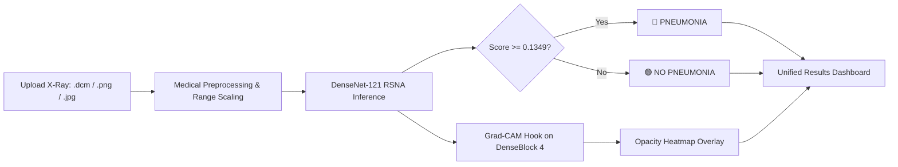

# 🫁 PneumoVision — AI-Assisted Pneumonia Screening from Chest X-Ray

An educational and research-grade Computer Vision system for screening chest radiographs (CXR) for **Pneumonia** and generating visual explainability heatmaps using **Grad-CAM**. Built as a **Computer Vision Open Elective Project (CV OEP)** for B.Tech Computer Engineering.

---

> [!WARNING]
> **Research Prototype Disclaimer**: This application is built strictly for academic, educational, and research demonstration purposes. It is **NOT** a certified medical diagnostic system and must **NEVER** be used to make clinical decisions or replace professional medical consultations. All predictions are AI-generated screening indicators, not clinical diagnoses.

---

## 1. System Overview & Architecture

PneumoVision integrates the official open-source **TorchXRayVision DenseNet-121** model pretrained on the **RSNA Pneumonia Detection Challenge** into a unified, end-to-end medical screening application.

```
E:\CV_OEP
│
├── app/
│   └── app.py                         # Unified Streamlit clinical screening application
│
├── src/                               # Modular application source packages
│   ├── data/                          # Medical imaging & dataset utilities
│   │   ├── dicom_utils.py             # MONOCHROME1/2 handling, windowing & tensor conversions
│   │   ├── dataset.py                 # PyTorch Dataset implementation for RSNA CXR
│   │   ├── split_data.py              # Patient-stratified split generator (70/15/15)
│   │   └── analyze_dataset.py         # Phase 1 dataset exploration & analysis
│   ├── models/                        # Model interfaces & inference wrappers
│   │   └── pneumonia_model.py         # PneumoniaModel wrapper for DenseNet-121 RSNA
│   └── explainability/                # Visual interpretability engine
│       └── gradcam.py                 # Grad-CAM heatmap generator targeting DenseBlock 4
│
├── third_party/
│   └── torchxrayvision/               # Locally vendored TorchXRayVision library (Apache 2.0)
│       ├── LICENSE                    # Apache License 2.0
│       └── torchxrayvision/           # Upstream source files (models, utils, datasets, etc.)
│
├── dataset/                           # Medical image dataset storage
│   ├── stage_2_train_labels.csv       # Raw RSNA annotations (30,227 rows, 26,684 patients)
│   ├── stage_2_train_images/          # 26,684 verified DICOM files (~3.82 GB)
│   ├── raw/
│   │   ├── images/                    # Derived 8-bit PNG images (*.png)
│   │   └── metadata.csv               # Master metadata mapping (patientId, dcm, png, label, split)
│   └── splits/                        # Leakage-free patient-stratified split metadata (seed=42)
│
├── checkpoints/                       # Pretrained model weights
│   └── densenet121-res224-rsna.pt     # Official DenseNet-121 RSNA weights (~27.07 MB)
│
├── results/                           # Evaluation figures, logs, and Grad-CAM test outputs
│   └── gradcam_test/                  # Sample Grad-CAM verification overlays
│
├── scripts/                           # Reproducibility & orchestration scripts
│   ├── setup_torchxrayvision_vendor.py# Vendors XRV source & downloads weights
│   ├── test_model_and_gradcam.py      # End-to-end DICOM inference & Grad-CAM verification
│   ├── convert_dicom_to_png.py        # High-speed parallel DICOM to PNG converter
│   └── download_dataset.py            # Kaggle dataset downloader
│
├── requirements.txt                   # Locked Python dependencies
├── THIRD_PARTY_NOTICES.md             # Third-party attribution & licensing documentation
└── README.md                          # Comprehensive project documentation
```

---

## 2. Pretrained Model Attribution & Specifications

PneumoVision utilizes an existing pretrained model rather than training from scratch, adhering to academic attribution standards:

| Specification | Technical Detail |
| :--- | :--- |
| **Model Name** | `densenet121-res224-rsna` |
| **Architecture** | DenseNet-121 (Densely Connected Convolutional Networks — Huang et al., CVPR 2017) |
| **Pretraining Benchmark** | RSNA Pneumonia Detection Challenge (NIH ChestX-ray14 subset) |
| **Source Project** | [TorchXRayVision](https://github.com/mlmed/torchxrayvision) (Joseph Paul Cohen et al., MIDL 2022) |
| **License** | Apache License 2.0 (see [THIRD_PARTY_NOTICES.md](file:///e:/CV_OEP/THIRD_PARTY_NOTICES.md)) |
| **Vendored Location** | `third_party/torchxrayvision/` |
| **Input Channels** | 1 (Grayscale) |
| **Input Dynamic Range** | Scaled to `[-1024, 1024]` (TorchXRayVision standard) |
| **Model Resolution** | 224 × 224 pixels |
| **Target Output** | `Pneumonia` (Class index 8 in model targets) |
| **Calibrated Decision Cutoff** | **`0.13486601` (~0.1349)** |

> [!NOTE]
> **Statistical & Clinical Distinction**: The raw model score is an operational screening output, **not an uncalibrated Bayesian probability**. A score $\ge 0.1349$ indicates features consistent with pulmonary opacity.

---

## 3. Explainability with Grad-CAM

To provide transparent visual interpretability:
- **Target Feature Layer**: `model.features.denseblock4` (DenseBlock 4, outputting 1,024 high-level feature channels).
- **Target Output Node**: Dynamic index corresponding to `Pneumonia` (Index 8).
- **Visualization**: Computes gradient weights via global average pooling, rectifies activations ($\text{ReLU}$), bilinearly upsamples to the original image dimensions, and blends an alpha overlay (`cv2.COLORMAP_JET`) over the grayscale radiograph.

---

## 4. Screening Workflow



1. **Step 1 — Upload**: Accepts `.dcm` (DICOM), `.png`, `.jpg`, `.jpeg`. Files are handled in-memory and are never written to the training dataset.
2. **Step 2 — Preprocessing**: Inverts `MONOCHROME1` to `MONOCHROME2` conventions, normalizes dynamic range to `[-1024, 1024]`, and constructs a `(1, 1, H, W)` tensor.
3. **Step 3 — AI Screening**: Evaluates DenseNet-121 and compares the Pneumonia score against the operational threshold (`0.1349`).
4. **Step 4 — Explainability**: Generates side-by-side alignment of the original radiograph and Grad-CAM opacity overlay.

---

## 5. How to Run the Application

### 5.1 Activate Virtual Environment
```powershell
& .venv\Scripts\Activate.ps1
```

### 5.2 Launch Streamlit Interface
```powershell
streamlit run app/app.py
```
Open your browser at `http://localhost:8501`.

---

## 6. How to Run Model & Grad-CAM Verification
To run an automated command-line verification on a real RSNA DICOM scan:
```powershell
& .venv\Scripts\python.exe scripts/test_model_and_gradcam.py
```
Expected output:
```text
MODEL: DenseNet-121 RSNA
TARGET: Pneumonia
TARGET_INDEX: 8
RAW_SCORE: 0.733125
THRESHOLD: 0.13486601
PREDICTION: PNEUMONIA
GRADCAM: PASS
GRADCAM_SHAPE: [7, 7]
OUTPUT_FILE: E:\CV_OEP\results\gradcam_test\0004cfab-14fd-4e49-80ba-63a80b6bddd6_gradcam.png
```

---

## 7. Academic References

1. **TorchXRayVision**: Cohen, J. P., et al. (2022). *TorchXRayVision: An Open-Source Software Library for Chest X-Ray Research*. Conference on Medical Imaging with Deep Learning (MIDL).
2. **DenseNet Architecture**: Huang, G., Liu, Z., et al. (2017). *Densely Connected Convolutional Networks*. IEEE CVPR 2017.
3. **Grad-CAM**: Selvaraju, R. R., et al. (2017). *Grad-CAM: Visual Explanations from Deep Networks via Gradient-Based Localization*. IEEE ICCV 2017.
4. **RSNA Challenge**: Stein, A., et al. (2018). *Radiological Society of North America (RSNA) Pneumonia Detection Challenge*. Kaggle & RSNA.
5. **NIH ChestX-ray14**: Wang, X., Peng, Y., et al. (2017). *ChestX-ray8: Hospital-scale Chest X-ray Database and Benchmarks*. IEEE CVPR 2017.
